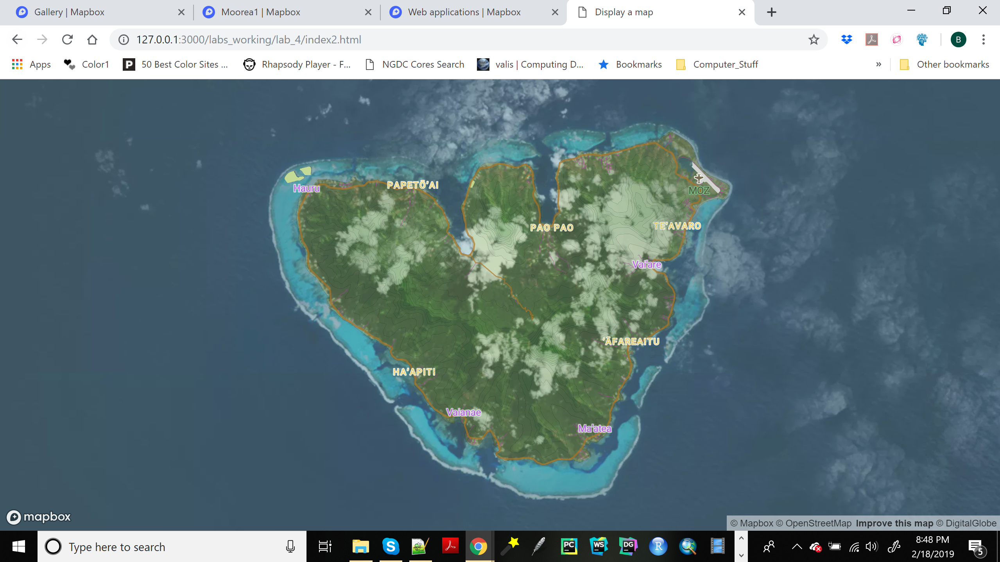
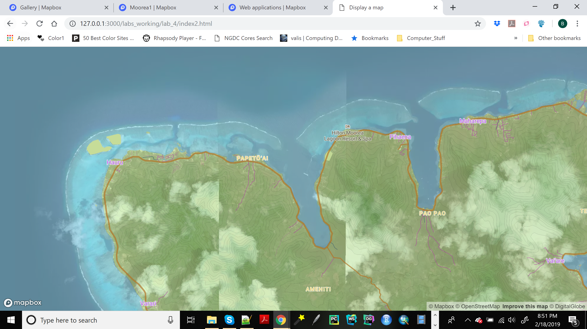
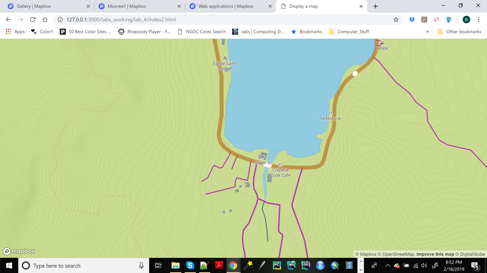

# Mo'orea Satellite Imagery, Slope, and Land Use Map #

The Mapbox style applied in this map was created to emphasize higher-slope and built-up regions of the French Polynesian island of Mo'orea while simultaneously displaying local satellite imagery provided by DigitalGlobe. Eventually, this Mapbox style will be applied to maps employed by an OSU NRT research project investigating the impact of onshore nutrient and sediment flow with offshore coral health, where vegetation density, slopes, and local land use are factors of interest. As a user zooms in at a progressively finer level of detail, the contour map becomes more opaque, until the satellite imagery is no longer visible. At a zoom scale of 14, the satellite imagery gives way entirely to a basic land use map of the island, emphasizing population centers across Mo'orea.

The purpose of the this sequence of satellite imagery, then contours, then land use map as a user zooms in progressively closer to the island is to permit the exploration of potential links between areas of higher slopes and soil disturbances (structures or buildings, urbanized areas, roads, etc.) with vegetation type, density, and coverage. Contour fills were symbolized using a bold green, allowing differentiation from vegetation in the satellite imagery layer below without unnecessary visual distraction, while contour lines have a fine line weight but a contrasting (orange-brown) color in order to provide a subtle guide to slope gradation. Town name labels, roads, and buildings have more highly contrasting colors palettes and symbology not only to draw the eye to elements of interest to the map, but also to allow easier differentiation of smaller, potentially easier to overlook features.

To access the map, please click on the following link: https://branblack3125.github.io/mooreasatellite/

Below is a short series of images serving as examples of the satellite imagery, contours, and local land use scales highlighted by this Mapbox style:

*Full island scale, emphasis on satellite imagery*

*Intermediate scale, combined contours and satellite imagery*

*Fine scale, human land uses*

